# Group 5 CSC 4850 Project

## Description

This repository contains the model testing python notebook used to generate data found in the Group 5 Project Report.

### References

- Link to the paper: [https://www.biorxiv.org/content/10.1101/2020.11.17.385757v1.full](https://www.biorxiv.org/content/10.1101/2020.11.17.385757v1.full)
- Link to the GitHub: [https://github.com/jiangdada1221/DrugOrchestra](https://github.com/jiangdada1221/DrugOrchestra)
- Link to the summary data: [https://drive.google.com/file/d/1JvGDiNMAqWJb4Ya0c7ahV9fM1MCjtkxA/view](https://drive.google.com/file/d/1JvGDiNMAqWJb4Ya0c7ahV9fM1MCjtkxA/view)
- Link to the preprocessed data: [https://drive.google.com/drive/folders/1SWqoulMh5-bmg4ewHXICkfaekPFYpWSh?usp=drive_link](https://drive.google.com/drive/folders/1SWqoulMh5-bmg4ewHXICkfaekPFYpWSh?usp=drive_link)

## Getting Started

These instructions will get you a copy of the project up and running on your local machine for testing purposes.

### Prerequisites

Before you begin, ensure you have the following installed:
- Git
- Python 3.x
- Jupyter Notebook or JupyterLab

### Installation

1. **Clone the Repository**

   First, clone the repository to your local machine using Git.

   ```bash
   git clone https://github.com/marendale/group_5_csc_4850.git
   ```
   
   Navigate to the repository directory.

   ```bash
   cd group_5_csc_4850
   ```
   
2. **Download the Data**
   
   Download the data from [https://drive.google.com/drive/folders/1SWqoulMh5-bmg4ewHXICkfaekPFYpWSh?usp=drive_link](https://drive.google.com/drive/folders/1SWqoulMh5-bmg4ewHXICkfaekPFYpWSh?usp=drive_link) and move it to the directory where you cloned the repository.
   
3. **Launch Jupyter Notebook**
   
   Start Jupyter Notebook or JupyterLab from the command line.

   ```bash
   jupyter notebook
   ```

   Or for JupyterLab:

   ```bash
   jupyter lab
   ```

4. **Open the Notebook**
   
   In the Jupyter interface, navigate to the directory where the repository was cloned and open the `Drug_Orchestra_Model_Testing.ipynb` file.

### Configuring the Notebook

With the `Drug_Orchestra_Model_Testing` notebook open, you can now run all the cells in the notebook. In Jupyter Notebook, you can do this by clicking on `Kernel` > `Restart & Run All`. In JupyterLab, the option might be slightly different but will be found under the Run menu.

## Results

### Model Results

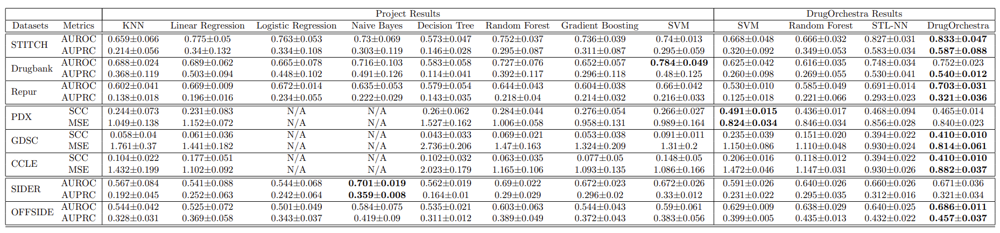

### Transferability

1. **KNN**

   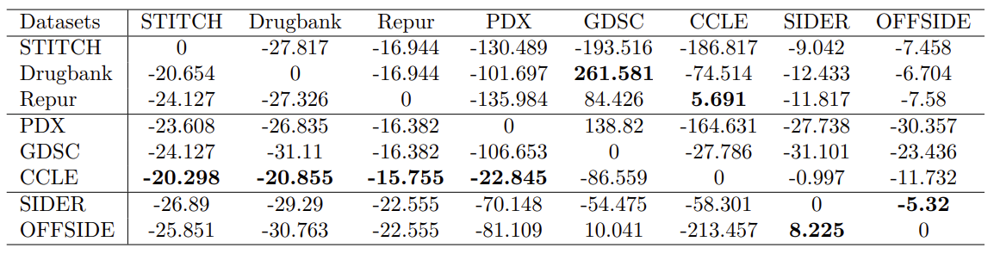
   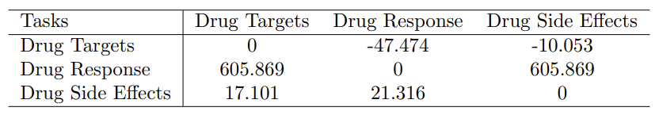

2. **Linear Regression**

   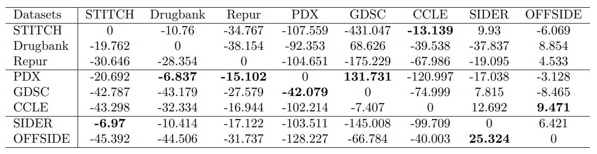
   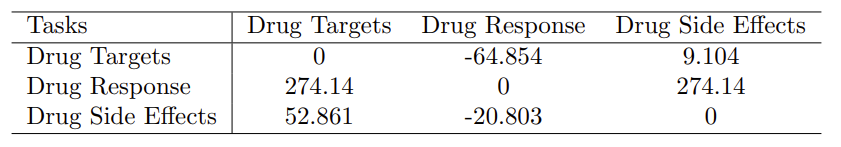

3. **Decision Tree**

   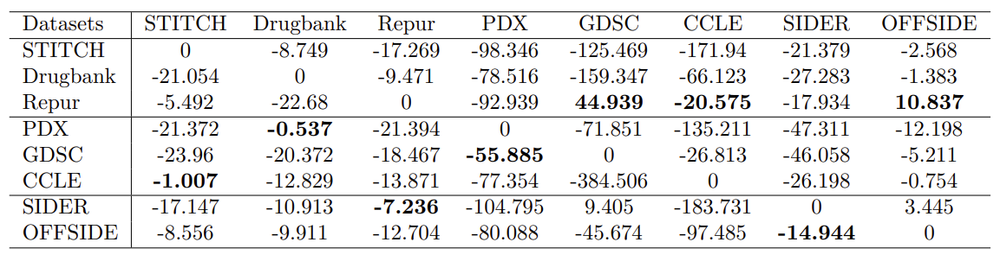
   

4. **Random Froest**

   
   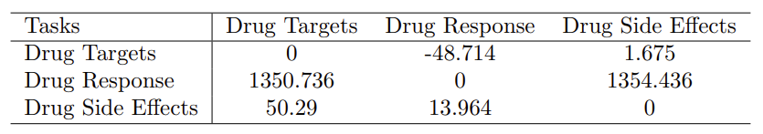


5. **Gradient Boosting Tree**
   
   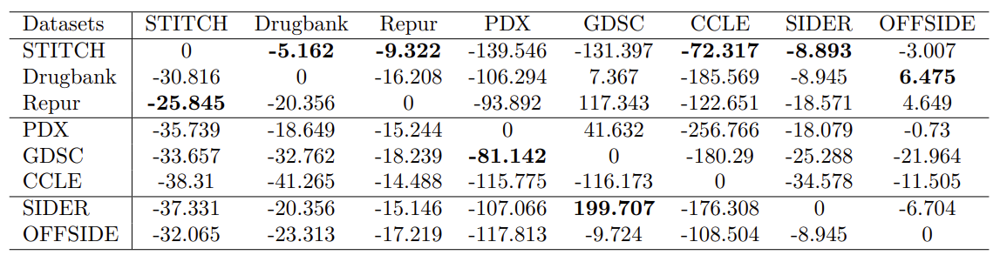
   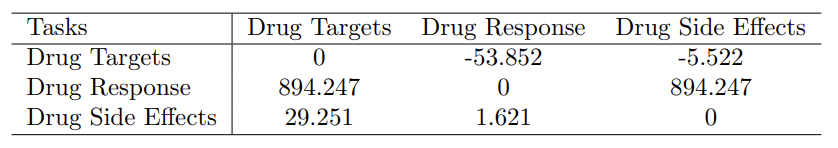


6. **SVM**

   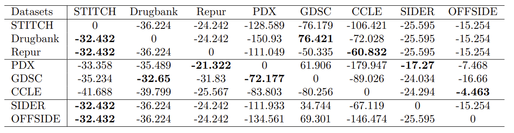
   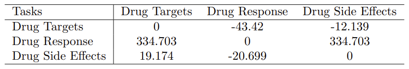


   

